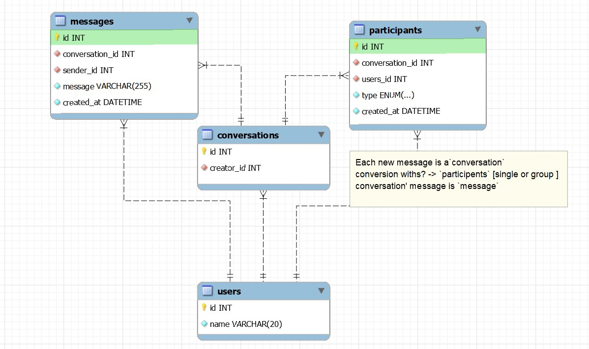

# Messenger

Messenger Database Design Concept for chat applications, by using this, you will be able to create group chat or a  one to one chat application without a hassle.

## Mini-version



> No need to maintain a `friendList` table as any user can send massages to anyone in Messenger.

## SQL

```SQL
create table users
(
    id   serial primary key,
    name varchar
);
create table conversation
(
    id        serial primary key,
    creatorId int references users (id) on delete cascade
);

create table messages
(
    id             serial primary key,
    content        varchar,
    sender         int references users (id) on delete cascade,
    conversationId int references conversation (id) on delete cascade
);

create table participants
(
    id             serial primary key,
    userId         int references users (id) on delete cascade,
    conversationId int references conversation (id) on delete cascade
)

select *
from users
order by name;

delete
from users
where email = 'F@gmail.com';

-- M sender-S1 receiver-R1 a7a5643e-c28f-4af1-acc4-5a450ff57dec d7013551-915f-4ad2-b5d2-2534ff102a1c
-- S1 creates Conv where participant -> R1
insert into conversation ("creatorId")
values ('a7a5643e-c28f-4af1-acc4-5a450ff57dec')
returning *;
-- c78985c1-e0be-4c4b-8a90-a7b158a41d57
insert into participants ("userId", "conversationId")
VALUES ('d7013551-915f-4ad2-b5d2-2534ff102a1c', 'c78985c1-e0be-4c4b-8a90-a7b158a41d57');
-- R1 creates Conv where participant -> S1
insert into conversation ("creatorId")
values ('d7013551-915f-4ad2-b5d2-2534ff102a1c')
returning *;
insert into participants ("userId", "conversationId")
VALUES ('a7a5643e-c28f-4af1-acc4-5a450ff57dec', '448fa3ab-5744-483f-a984-720d0ed161ea');

-- Save msg both in S1 and R1's conv
insert into message (content, "senderId", "conversationId")
VALUES ('1. Hi I"m A', 'a7a5643e-c28f-4af1-acc4-5a450ff57dec', 'c78985c1-e0be-4c4b-8a90-a7b158a41d57');
insert into message (content, "senderId", "conversationId")
VALUES ('1. Hi I"m A', 'a7a5643e-c28f-4af1-acc4-5a450ff57dec', '448fa3ab-5744-483f-a984-720d0ed161ea');

-- M S2 R1 a7a5643e-c28f-4af1-acc4-5a450ff57dec d7013551-915f-4ad2-b5d2-2534ff102a1c
-- conversation between 1 2 and 2 1 exits?
select count("userId")
from participants p
         left join conversation c on c.id = p."conversationId"
where (c."creatorId" = 'a7a5643e-c28f-4af1-acc4-5a450ff57dec' and p."userId" = 'd7013551-915f-4ad2-b5d2-2534ff102a1c')
   or (c."creatorId" = 'd7013551-915f-4ad2-b5d2-2534ff102a1c' and p."userId" = 'a7a5643e-c28f-4af1-acc4-5a450ff57dec');
;
-- YES
-- Save msg both in A and B's conv
insert into message (content, "senderId", "conversationId")
VALUES ('2. Hi I"m B', 'd7013551-915f-4ad2-b5d2-2534ff102a1c', 'c78985c1-e0be-4c4b-8a90-a7b158a41d57');
insert into message (content, "senderId", "conversationId")
VALUES ('2. Hi I"m B', 'd7013551-915f-4ad2-b5d2-2534ff102a1c', '448fa3ab-5744-483f-a984-720d0ed161ea');

-- M S2 R3 d7013551-915f-4ad2-b5d2-2534ff102a1c 5f2dd590-0a27-4ce8-918d-d6d41eec2794
-- conversation between 3 2 and 2 3 exits?
select count("userId")
from participants p
         left join conversation c on c.id = p."conversationId"
where (c."creatorId" = '5f2dd590-0a27-4ce8-918d-d6d41eec2794' and p."userId" = 'd7013551-915f-4ad2-b5d2-2534ff102a1c')
   or (c."creatorId" = 'd7013551-915f-4ad2-b5d2-2534ff102a1c' and p."userId" = '5f2dd590-0a27-4ce8-918d-d6d41eec2794');
;
-- NO
-- 3 creates Conv where P -> 2
insert into conversation ("creatorId")
values ('5f2dd590-0a27-4ce8-918d-d6d41eec2794')
returning *;
-- c78985c1-e0be-4c4b-8a90-a7b158a41d57
insert into participants ("userId", "conversationId")
VALUES ('d7013551-915f-4ad2-b5d2-2534ff102a1c', '6f9ca6ca-c6f8-4d27-b502-06d3e89b2c0a');
-- 2 creates Conv where P -> 3
insert into conversation ("creatorId")
values ('d7013551-915f-4ad2-b5d2-2534ff102a1c')
returning *;
insert into participants ("userId", "conversationId")
VALUES ('5f2dd590-0a27-4ce8-918d-d6d41eec2794', 'f6aa47d0-62b3-4f63-81c2-b5c565984978');

-- Save msg both in B and C's conv
insert into message (content, "senderId", "conversationId")
VALUES ('3. Hi I"m B', 'd7013551-915f-4ad2-b5d2-2534ff102a1c', '6f9ca6ca-c6f8-4d27-b502-06d3e89b2c0a');
insert into message (content, "senderId", "conversationId")
VALUES ('3.. Hi I"m B', 'd7013551-915f-4ad2-b5d2-2534ff102a1c', 'f6aa47d0-62b3-4f63-81c2-b5c565984978');

-- M S1 R3 a7a5643e-c28f-4af1-acc4-5a450ff57dec 5f2dd590-0a27-4ce8-918d-d6d41eec2794
-- conversation between 3 2 and 2 3 exits?
select count("userId")
from participants p
         left join conversation c on c.id = p."conversationId"
where (c."creatorId" = '5f2dd590-0a27-4ce8-918d-d6d41eec2794' and p."userId" = 'd7013551-915f-4ad2-b5d2-2534ff102a1c')
   or (c."creatorId" = 'd7013551-915f-4ad2-b5d2-2534ff102a1c' and p."userId" = '5f2dd590-0a27-4ce8-918d-d6d41eec2794');
;

select c.id as cid, m.content, m."senderId", u2.name as rcvr, u.name as usr
from conversation c
         left join users u on u.id = c."creatorId"
         left join participants p on c.id = p."conversationId"
         left join users u2 on u2.id = p."userId"
         left join message m on c.id = m."conversationId"
where c."creatorId" = '867881ff-1a50-445a-8ae1-50b1f39f49ec'
  and u2.id != '867881ff-1a50-445a-8ae1-50b1f39f49ec'
order by m.updated_at ASC ,c.updated_at ASC ;


select c.id as cid,c."creatorId", u.name as A, u2.name as B, u.id as aid,p."userId" as bid
from conversation c
         left join users u on c."creatorId" = u.id
         left join participants p on c.id = p."conversationId"
         left join users u2 on u2.id = p."userId";


select *
from conversation;

truncate message;

delete
from conversation
where id = '705a6d48-de08-48d2-9ca8-efe7a92a34e0';

truncate participants;

truncate  conversation cascade ;
```

## Full-version

Idea from.. [https://github.com/yoosuf/Messenger](https://github.com/yoosuf/Messenger)


